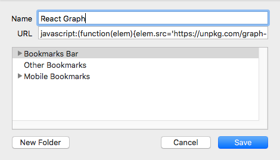

# React Graph Bookmarklet

This tool generates a graph of the runtime dependencies between your react components.

[See it in action here](https://gfycat.com/VapidFarflungHummingbird)

## Usage

First, add this code as a bookmarklet

```
javascript:(function(elem){elem.src='https://unpkg.com/graph-react-bookmarklet/dist/main.js'; document.documentElement.appendChild(elem);})(document.createElement('script'))
```



Then view a React 16 website and click the bookmark.

# Disclaimer

This tool touches internal parts of React and therefore may not work in the future. Tested against react@16.2.0.